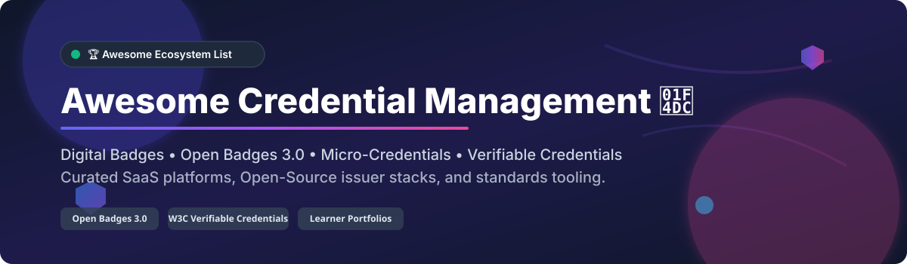

  

# 📜 Awesome Credential Management 🌟

  
  
  
  
  

---

## 🎯 Ecosystem Overview & Market Dynamics 📊

> 💡 **Market Size & Structure**: The global **Digital Credential & Badging Management** market is estimated at **$278M – $370M (2026)** and projected to exceed **$1.2B+ by 2032** (with the broader credentialing software market exceeding **$2.5B**). The sector currently exhibits **moderate fragmentation**, with leading platform suites like Pearson Credly and Accredible coexisting alongside emerging niche tools. However, the market is rapidly consolidating as HR-tech platforms integrate verifiable credential stacks, moving toward a concentrated market structure.

---

## 🚀 SaaS & Hosted Platforms 💼

| Platform | Description | Pricing | Free Tier / Trial Limits | Company Size / Financials |
| :--- | :--- | :--- | :--- | :--- |
| **[Credly](https://www.credly.com/)** 🏢 | Enterprise digital credential network (Pearson) widely used for IT and professional certification ecosystems with strong employer recognition. | $1,500/year (Estimated starting tier) | No free tier or public trial available; enterprise sales demo required | Subsidiary of Pearson (Acquired; Pre-acquisition raised $20M+ VC; Est. $10M+ ARR) |
| **[PeopleCert](https://www.peoplecert.org/)** 🌍 | Global certification body (ITIL, PRINCE2) and credential ecosystem with digital badge delivery. | Exam dependent; Subscriptions from ~$49/year | Essential free account available (Basic badge display & profile management) | Private Enterprise (£120M – £160M ARR; Acquired Axelos for £380M) |
| **[Canvas Credentials](https://www.instructure.com/)** 🎓 | Instructure/Canvas-native credentialing (formerly Badgr) built for academic institutions and enterprise LMS workflows. | $1,000+/year (Institutional LMS add-on pricing) | Free tier discontinued; institutional sales demo required | Subsidiary of Instructure (Private Equity buyout at $4.8B valuation) |
| **[Accredible](https://www.accredible.com/)** 🏆 | Enterprise digital credential platform for high-volume issuance, design, integrations, and distribution of badges and certificates. | $45/month (Launch Plan, billed annually) | Free demo available; paid tiers required for ongoing issuance | VC-backed Growth (~$26.5M Total VC Raised; Est. $1.4M+ ARR) |
| **[Open Badge Factory](https://openbadgefactory.com/)** 🇪🇺 | European-oriented Open Badges platform for creating, issuing, and managing digital badges aligned with open standards. | €220/year (~$240/year Basic plan) | 60-day free trial (Up to 50 badge issuances/day, Pro features included) | Bootstrapped / Private SMB |
| **[Virtualbadge.io](https://www.virtualbadge.io/)** ⚡ | Digital badge and certificate issuance platform for training providers, events, and organizations. | $35/month (Lite Plan) | 7-day free trial (Full access to Lite features) | Private SMB (Operated by FutureNext GmbH) |
| **[Certifier](https://certifier.io/)** 🎨 | Modern certificate and badge issuance platform focused on speed, design, and high-volume one-off and program credentials. | $33/month (Professional Plan, billed annually) | **Forever Free Plan** (Up to 250 credentials/year, no credit card required) | Seed-stage Startup (~$1M Total VC Raised) |
| **[Certopus](https://certopus.com/)** 🤖 | Certificate and credential management platform for automated issuance and verification workflows. | $24.99/month (Starter plan) | **Forever Free Plan** (Up to 250 credentials/year, 2 events, 1 seat) | Seed-stage Startup (Devsquirrel Tech; Est. <$1M ARR) |

---

## 🔓 Open-Source GitHub Projects 🛠️

| Repository | Description | Stars |
| :--- | :--- | :--- |
| **[hyperledger/indy-sdk](https://github.com/hyperledger/indy-sdk)** | Developer kit for Hyperledger Indy decentralized identity and verifiable credential management. |  |
| **[uport-project/veramo](https://github.com/uport-project/veramo)** | JavaScript framework for Verifiable Credentials, Decentralized Identifiers (DIDs), and Web3 identity. |  |
| **[hyperledger/aries-cloudagent-python](https://github.com/hyperledger/aries-cloudagent-python)** | Open-source Python agent for building SSI and Verifiable Credential issuing/verifying services. |  |
| **[decentralized-identity/sidetree](https://github.com/decentralized-identity/sidetree)** | Protocol for decentralized identity and verifiable credential networks (DIF standard). |  |
| **[1EdTech/openbadges-specification](https://github.com/1EdTech/openbadges-specification)** | Official specification and technical reference schema for the 1EdTech Open Badges standard. |  |
| **[walt-id/waltid-ssikit](https://github.com/walt-id/waltid-ssikit)** | Kotlin/Java SSI toolkit for W3C Verifiable Credentials and OpenID4VC issuing/verification. |  |
| **[schroedinger-hat/certo](https://github.com/schroedinger-hat/certo)** | Open-source platform for issuing, managing, and verifying credentials using Open Badges 3.0 and W3C VCs. |  |
| **[digital-promise/badge-engine](https://github.com/digital-promise/badge-engine)** | Open-source digital badging engine for creating and managing badge programs aligned with Open Badges 3.0. |  |

---

## 🤝 How to Contribute 📝

1. **Fork** the repository.
2. Add or edit entries in `README.md` following the established table structure.
3. Include: Product/Repo name, description, verified pricing/stars, and links.
4. Submit a **Pull Request** with a brief summary of additions.

---

## 📈 Star History

---

## 💖 Support & Community ☕

Thank you for exploring **Awesome Credential Management**! If you find this curated resource helpful for your work, education program, or developer stack, please consider supporting the project:

- ⭐ **Star** this repository to increase visibility.
- 🔀 **Fork** and contribute new tools or update missing entries.
- 📢 **Share** this list with fellow educators, developers, and credentials enthusiasts!
- ☕ **Buy Me a Coffee**: Support ongoing open-source maintenance via [GitHub Sponsors](https://github.com/sponsors/ishandutta2007).

---

## ⚠️ Disclaimer ⚖️

*This list is community-curated for informational purposes. Product specifications, pricing, and GitHub star counts are updated periodically. Digital credential implementations should comply with identity, privacy, and security standards applicable to your jurisdiction.*
